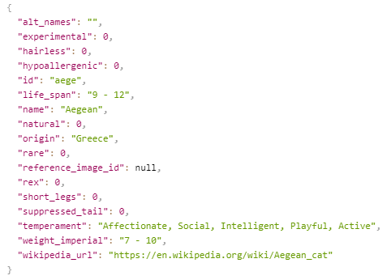
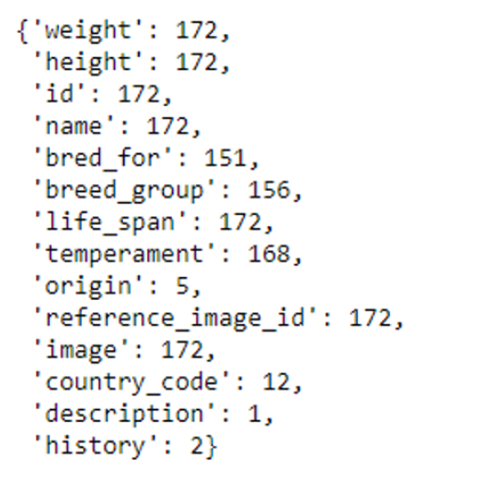

# Doggos Webpage

## Welcome to our Webpage about dogs!

### *Overview* 
* Website Purpose 

* Data: Extracting, Transforming, Loading 

* Website Outline 

  * Homepage 

  * Doggo information page 

  * Find your perfect puppers page 

  * Doggy Data (visualizations) 

  * Dungeons&Doggos 

* Reflections on this Project 

## Website Purpose
*We love dogs, what more can we say?*  

The purpose of this website is to:
* provide information on dog breeds
* help users find their perfect dog
* provide meaningful data visualizations of our doggy data
* AND -last but not least - create a Dungeons&Dragons-style game where users can select dog characters to "play" against each other and see who wins out (cleverly named Dungeons&Doggos).  
  

#### Our project had to include the following:
* Python Flask-powered API 
* HTML, CSS, & JavaScript
* One Database (relational or non-relational)
* 1 of 4 Tracks:
  * A custom “creative” D3.js project (i.e., a nonstandard graph or chart)
  * A combination of web scraping and Leaflet or Plotly
  * A dashboard page with multiple charts that update from the same data
  * A “thick” server that performs multiple manipulations on data in a database prior to visualization
* A new JS Library not already used in the course
* Dataset with at least 100 records
* User-driven interactions (drop-downs, menus, textboxes)
* Visualizations with at least 3 views

This is how we decided to fulfill these requirements:
* *Python Flask-powered API, HTML, CSS, & JavaScript* - fulfilled when creating the website
* *One Database (relational or non-relational)* - SQL (relational), using Postgres (PgAdmin)
* *1 of 4 Tracks* - custom “creative” D3.js project (i.e., a nonstandard graph or chart)
* *A new JS Library not already used in the course* - Lodash
* *Dataset with at least 100 records* - [The Dog API](https://thedogapi.com/), contains 172 dog breeds!
* *User-driven interactions (drop-downs, menus, textboxes)* - fulfilled when creating the structure of our website (dashboard)
* *Visualizations with at least 3 views* - 4 pages (Dog Breed information, Find Your Perfect Dog, Dog Data Visualization, Dungeons&Doggos) each containing their own unique views of the data
 
## Our Data Journey: Extracting, Transforming, Loading
*We just need an API of quality dog data, how hard can that be to find? Everyone loves dogs!* 

On our initial quest in search of basic dog breed information APIs, we stumbled upon [The Dog API](https://thedogapi.com/) website. It showed promising results, as the picture below shows:

#### Hopeful Beginnings
We were excited for this data. This API would give us a dog breed name, its life span, country of origin, rarity, a reference image ID (for adding a picture), physical characteristics (short legs, suppressed tail, etc), temperaments, and a wikipedia url (among other things). We had come up with a few ideas for how to use this information:
* country of origin - wouldn't it be cool to have a heat map of where dog breeds originated from? Would we see any patterns?
* physical characteristics (short legs, suppressed tail, etc) - we could add these traits to our D&Doggos game as bonuses/penalties to dog abilities (for example, short legs could give a -2 to jumping or a bonus to evasion - we all know how hard tiny animals are to catch)
* temperaments - we could break down this list and look for frequency of each temperament to see what dogs are most commonly bred for
* wikipedia url - if users need more information, we could guide them to wikipedia

#### The Truth Comes Out (Data Cleaning)
In our first steps of data cleaning, we needed to retrieve the API's json information and create a dataframe from this data. This is when we realized what we were really working with. The image below shows a dictionary we created to preview the types of dog data that existed in all 172 records, along with the count of that specific field.

 
As you can gather, fields we were expecting to use were minimal or non-existant ('origin' shows 5 occurances in all 172 dog breed records and phsyical attributes were not included at all). We're not sure what the developers of this API have updated or changed since the example was presented in their documentation, but apparently a lot was missing or had changed drastically. We decided to scrap our heat map and wikipedia information ideas and revisit the physical characteristics once we got working on our D&Doggos page (fortunately, it was something we could visually see in dog photos). 

#### Some Underdogs of this Data
While we were disappointed of our recent enlightenments, we did come across some new fields that peaked our interests. For example, "breed group" and "bred for" would be excellent categorical visualizations we could include. In addition, temperaments were enough to use in our visualizations. 

 
Our data cleaning progressed further:
* **Temperaments:** splitting the temperament lists into individual temperaments, then for-looping to create a list of unique temperaments
* **Breed Groups:** pulling all groups, replacing blanks with "None", and putting those values into a list of unique breed groups
* **Bred For:** we realized this key contained inconsistent user input (whole sentences or phrases and little to know duplicates)
1. we tried looking for key words by splitting the senctences and putting each word in a dictionary as a key with their count as the value
2. however, this didn't work out because we came up with articles (in, a, an, the, for, etc) and different versions of the same word (hunter, hunting, hunt)
3. in the end, we decided to scrap the visualization for this field

## Website Outline
### Homepage
### Doggo information page
### Find your perfect puppers page
### Doggy Data (visualizations)
### Dungeons&Doggos
## Reflections on this Project
