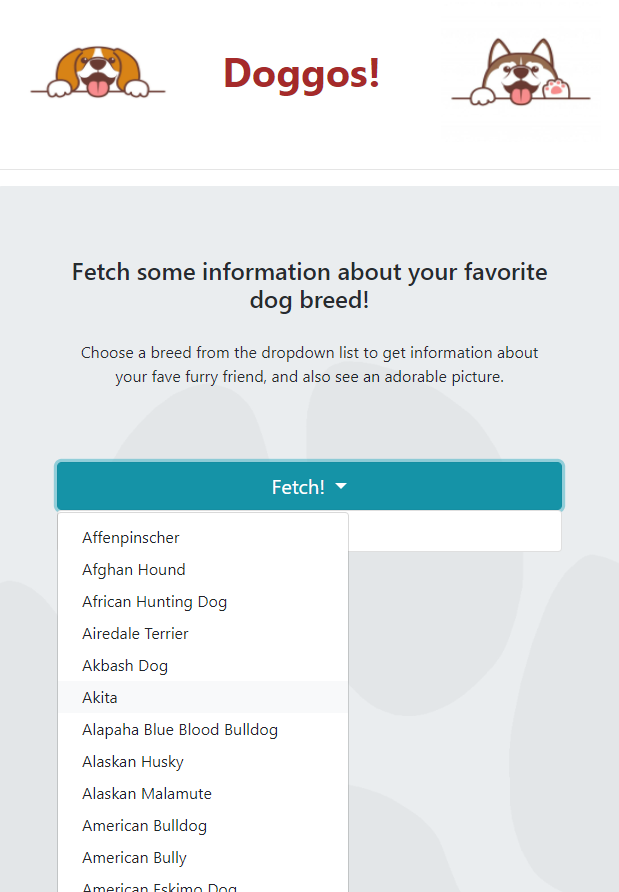

# Doggos Webpage

## Welcome to our Webpage about dogs!

### *Overview* 
* Website Purpose 

* Data: Extracting, Transforming, Loading 

* Website Outline 

  * Homepage 

  * Doggo information page 

  * Find your perfect puppers page 

  * Doggy Data (visualizations) 

  * Dungeons&Doggos 

* Reflections on this Project 

## Website Purpose
*We love dogs, what more can we say?*  

The purpose of this website is to:
* provide information on dog breeds
* help users find their perfect dog
* provide meaningful data visualizations of our doggy data
* AND -last but not least - create a Dungeons&Dragons-style game where users can select dog characters to "play" against each other and see who wins out (cleverly named Dungeons&Doggos).  
  

#### Our project had to include the following:
* Python Flask-powered API 
* HTML, CSS, & JavaScript
* One Database (relational or non-relational)
* 1 of 4 Tracks:
  * A custom “creative” D3.js project (i.e., a nonstandard graph or chart)
  * A combination of web scraping and Leaflet or Plotly
  * A dashboard page with multiple charts that update from the same data
  * A “thick” server that performs multiple manipulations on data in a database prior to visualization
* A new JS Library not already used in the course
* Dataset with at least 100 records
* User-driven interactions (drop-downs, menus, textboxes)
* Visualizations with at least 3 views

This is how we decided to fulfill these requirements:
* *Python Flask-powered API, HTML, CSS, & JavaScript* - fulfilled when creating the website
* *One Database (relational or non-relational)* - SQL (relational), using Postgres (PgAdmin)
* *1 of 4 Tracks* - custom “creative” D3.js project (i.e., a nonstandard graph or chart)
* *A new JS Library not already used in the course* - Lodash
* *Dataset with at least 100 records* - [The Dog API](https://thedogapi.com/), contains 172 dog breeds!
* *User-driven interactions (drop-downs, menus, textboxes)* - fulfilled when creating the structure of our website (dashboard)
* *Visualizations with at least 3 views* - 4 pages (Dog Breed information, Find Your Perfect Dog, Dog Data Visualization, Dungeons&Doggos) each containing their own unique views of the data
 
## Our Data Journey: Extracting, Transforming, Loading
*We just need an API of quality dog data, how hard can that be to find? Everyone loves dogs!* 

On our initial quest in search of basic dog breed information APIs, we stumbled upon [The Dog API](https://thedogapi.com/) website. It showed promising results, as the picture below shows:

#### Hopeful Beginnings
We were excited for this data. This API would give us a dog breed name, its life span, country of origin, rarity, a reference image ID (for adding a picture), physical characteristics (short legs, suppressed tail, etc), temperaments, and a wikipedia url (among other things). We had come up with a few ideas for how to use this information:
* country of origin - wouldn't it be cool to have a heat map of where dog breeds originated from? Would we see any patterns?
* physical characteristics (short legs, suppressed tail, etc) - we could add these traits to our D&Doggos game as bonuses/penalties to dog abilities (for example, short legs could give a -2 to jumping or a bonus to evasion - we all know how hard tiny animals are to catch)
* temperaments - we could break down this list and look for frequency of each temperament to see what dogs are most commonly bred for
* wikipedia url - if users need more information, we could guide them to wikipedia

#### The Truth Comes Out (Data Cleaning)
In our first steps of data cleaning, we needed to retrieve the API's json information and create a dataframe from this data. This is when we realized what we were really working with. The image below shows a dictionary we created to preview the types of dog data that existed in all 172 records, along with the count of that specific field.

 
As you can gather, fields we were expecting to use were minimal or non-existant ('origin' shows 5 occurances in all 172 dog breed records and phsyical attributes were not included at all). We're not sure what the developers of this API have updated or changed since the example was presented in their documentation, but apparently a lot was missing or had changed drastically. We decided to scrap our heat map and wikipedia information ideas and revisit the physical characteristics once we got working on our D&Doggos page (fortunately, it was something we could visually see in dog photos). 

#### Some Underdogs of this Data
While we were disappointed of our recent enlightenments, we did come across some new fields that peaked our interests. For example, "breed group" and "bred for" would be excellent categorical visualizations we could include. In addition, temperaments were enough to use in our visualizations. 

 
Our data cleaning progressed further:
* **Temperaments:** splitting the temperament lists into individual temperaments, then for-looping to create a list of unique temperaments
* **Breed Groups:** pulling all groups, replacing blanks with "None", and putting those values into a list of unique breed groups
* **Bred For:** we realized this key contained inconsistent user input (whole sentences or phrases and little to know duplicates)
  * we tried looking for key words by splitting the senctences and putting each word in a dictionary as a key with their count as the value
  * however, this didn't work out because we came up with articles (in, a, an, the, for, etc) and different versions of the same word (hunter, hunting, hunt)
  * in the end, we decided to scrap the visualization for this field

## Website Outline
### Homepage
Our intro page starts off the user with 4 options: Dog Breed Info, Find Your Perfect Dog, Compare Doggo Data, and Dungeons&Doggos 

 
 

### Dog Breed Info page
Here we have a dropdown menu with over 100 dog breeds available to choose from. When you click on a dog breed, there is a card with a few facts about that particular breed. 

 
 

### Find Your Perfect Dog page
This page has 29 of the top temperaments shared by the available dog breeds. You are allowed to only choose three temperaments that you would like to choose in a dog. From your choices, there are either results that show containing a picture of the dog and some facts about the breed, or no results with a message prompting you to try your search again. You can also change your choices by hitting the reset button and clearing the selections. 

  

### Compare Doggo Data (visualizations)
We had some data points spanning the dog breeds regarding weight, height, and life span, and wanted to display these data with plots, and show trends in the data that may be interesting. We found that there are trends that show smaller and lighter dogs live much longer than taller or heavier dogs.
 

 
 

### Dungeons&Doggos
This is the future webpage! This was going to be our bonus page containing a game where you choose fictitious doggy characters with special and unusual powers, that use these powers in exciting ways to battle each other for bragging rights and power over the others. Unfortunately we did not get a chance to create the page, but we plan to do so soon. 

 
 
  

## Reflections on this Project
#### Dungeons&Doggos: A quest not yet unlocked
With the other requirements of our project, we were unable to get to the most anticipated part of our project, the D&D-like dog play page. Hopefully we'll be able to finish it in the future, so be sure to check on our site from time to time for updates!

#### The Dog API data: a lesson in pre-planning
An important step in any data analytics related project - get a metadata summary! Everything on the internet is constantly updating, changing, or going out-of-date. The important lesson we learned here was to really dig into what the data looks like instead of trusting an example that might not have been updated with the actual data. Get the metadata summary, see what's there to work with and what might be missing before committing to it as a reliable data source.

#### Github Group Work: COMMUNICATION
In a project like this, communication and consistent commit habits are what help the group machine run well. We ran into many issues of not all having the correct information because someone didn't commit their work (not saying it was me most of the time, but it was me most of the time). This project was a hard but NECESSARY lesson in development teamwork.

#### Unexpected Issues: the art of googling
When it comes down to creating an API from a SQL database and calling on that API to access information from it, there were unexpected issues around permissions and CORS access, something that we had never heard of. It caused the API to work one day and throw an error message the next. Issues like these required lots of googling and refining google search terms to be able to guide ourselves to the correct answers. Using Google to tell you what is wrong with your code in a way that is actually helpful and applicable to your exact situation is an art in itself. Lesson learned.
